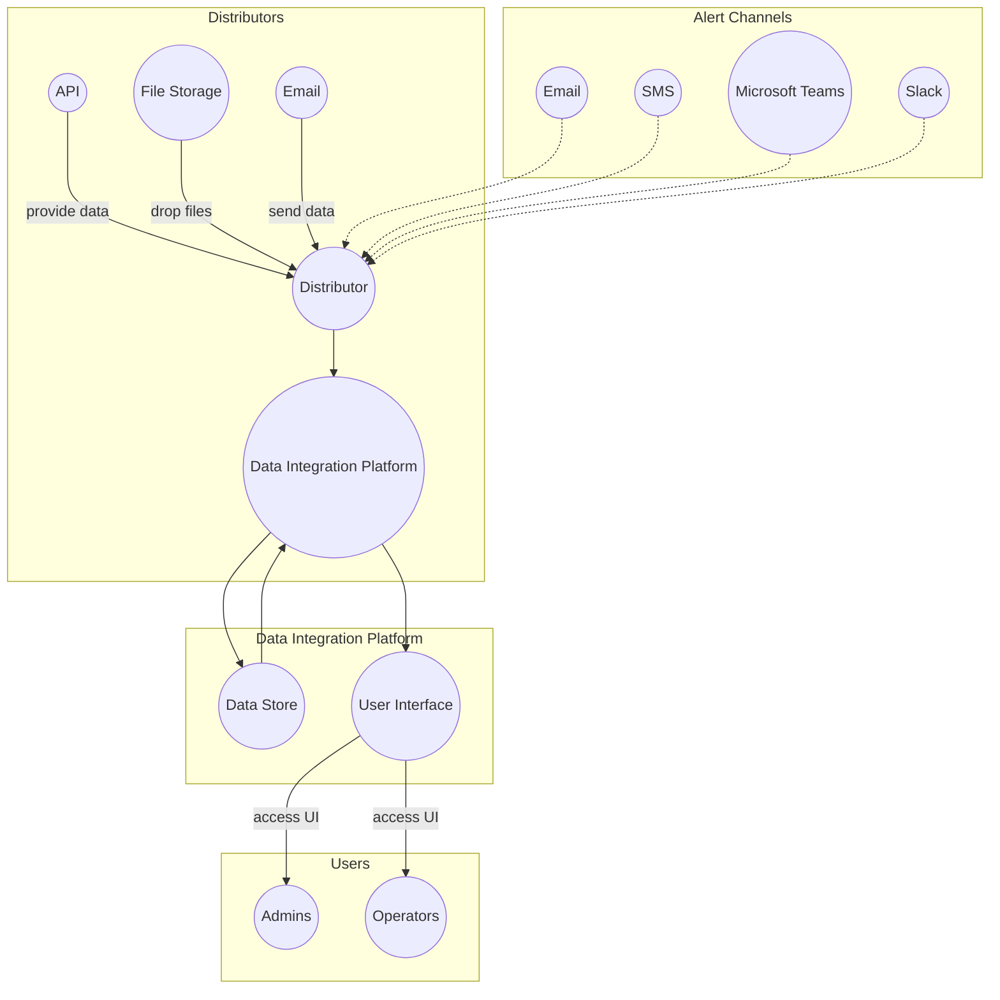
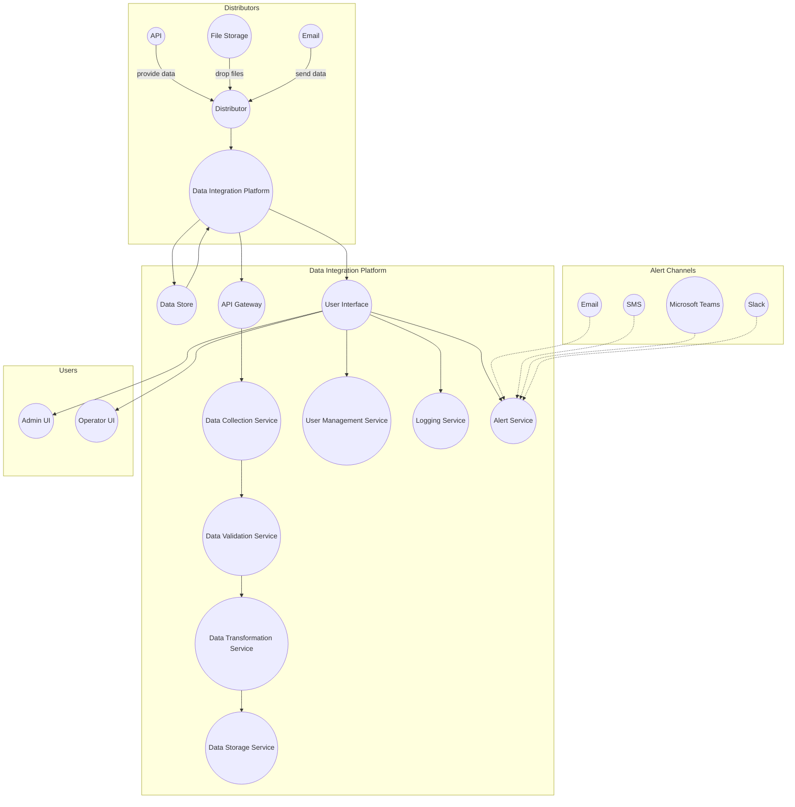
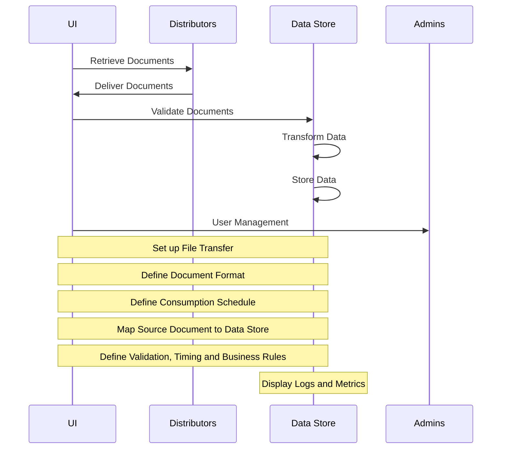

  # Context Diagram

# Container Diagram

# Containers

* Data Collection Service: This service is responsible for collecting data from different sources, such as APIs, file storage systems, and email. It communicates with each distributor to get the data documents and validate them for format, content, and timing.

* Data Validation Service: This service is responsible for validating the data documents according to defined business rules. It communicates with the Data Collection Service to get the documents and returns alerts to the Alert Service in case of issues.

* Data Transformation Service: This service is responsible for transforming the data documents into a common format for analysis. It communicates with the Data Validation Service to get the validated documents and transforms them into the target format.

* Data Storage Service: This service is responsible for storing the transformed data documents in the data store (data lake). It communicates with the Data Transformation Service to get the transformed documents and stores them in the appropriate location.

* API Gateway: This component is responsible for handling the incoming requests from the distributors and routing them to the appropriate service.

* User Interface: This component provides a UI for configuring the file transfers and defining the validation, timing, and business rules.

* User Management Service: This service is responsible for managing users and roles within the application.

* Logging Service: This service

# More

# System Components
* User Interface
The User Interface is responsible for the configuration of the File Transfer, Document Format, Consumption Schedule, Field Mapping, and Rules for Validation, Timing, and Business Rules. The UI also provides the Dashboard to view the logs and metrics of the Data Integration Platform.

* Distributors
The Distributors are responsible for providing Data Documents to the Platform. The Data Documents can be in various formats and delivered through different methods, such as API, File Storage Systems, Email, Document Management Systems, or the internal File Storage System provided by the Platform.

* Data Store
The Data Store is responsible for storing Data Documents and performing transformations on the data to move it to a common format for analysis and possible further transformation. It also validates the Documents for Format, Content, Timing, and other Business Rules defined by the User Interface.

* Admins
The Admins are responsible for User Management in the Data Integration Platform. They can create Users and Roles that can perform and view different components and actions within the Platform.

* Conclusion
The Data Integration Platform is designed to handle disparate sets of data documents from different sources and deliver them to a common format for analysis. The Platform is flexible and can consume data from various sources, validate the data, transform it to a common format, and store it in a Data Store for analysis. The User Interface provides the configuration and monitoring of the Platform, while the Admins provide the User Management.